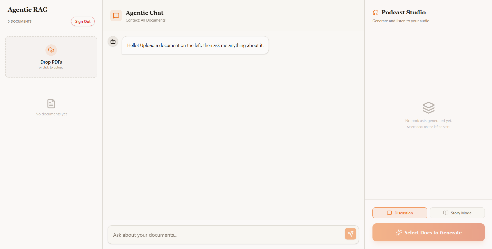
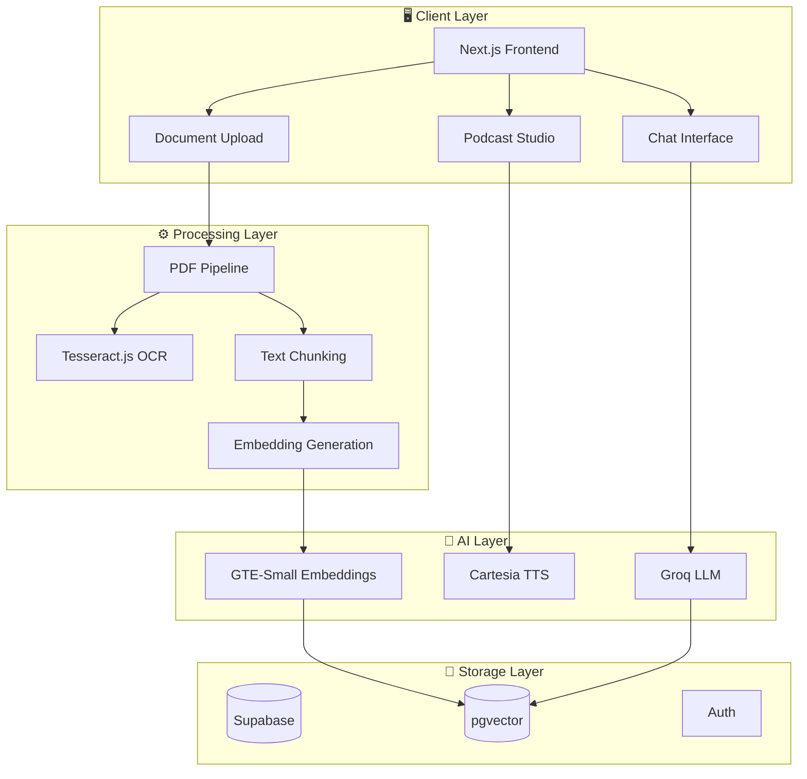

<div align="center">

# 🧠 RAG-Sandbox

### Multi-Tenant Agentic RAG Platform

[](https://nextjs.org/)
[](https://www.typescriptlang.org/)
[](https://supabase.com/)
[](https://tailwindcss.com/)
[](./LICENSE)

**Transform your documents into intelligent, queryable knowledge bases with AI-powered podcasts and story generation.**

[🚀 Live Demo](#) • [📖 Documentation](#api-reference) • [🐛 Report Bug](https://github.com/yourusername/rag-sandbox/issues)

</div>

---

## 📸 Website Preview

<div align="center">

### 🏠 Landing Page
.png)

### 📄 Document Upload & Processing
.png)

### 💬 RAG Query Interface


</div>

---


## ✨ Features

<table>
<tr>
<td width="50%">

### 📁 Multi-Format Document Processing
- **PDF** - Native text extraction + OCR for scanned documents
- **DOCX** - Microsoft Word document support
- **CSV** - Structured data ingestion
- **JSON** - JSON file parsing
- **TXT** - Plain text files
- **Gmail** - Direct email integration

</td>
<td width="50%">

### 🔍 Intelligent RAG System
- **Vector Search** - Supabase pgvector for semantic similarity
- **Smart Chunking** - LangChain text splitters
- **Context Retrieval** - Top-k relevant chunks
- **Conversational AI** - Chat history aware responses
- **Multi-tenant** - Isolated user data spaces

</td>
</tr>
<tr>
<td width="50%">

### 🎙️ AI Podcast Generation
- **Discussion Mode** - Two-voice interview-style podcasts
- **Story Mode** - First-person narration
- **Cartesia TTS** - Premium text-to-speech
- **Audio Player** - Built-in playback controls
- **Download Support** - Export generated audio

</td>
<td width="50%">

### 🛠️ Developer-Friendly
- **MCP Protocol** - Model Context Protocol support
- **REST API** - Full API access via Postman
- **Edge Functions** - Supabase edge for embeddings
- **Type-Safe** - Full TypeScript coverage
- **Modern Stack** - React 19 + Next.js 16

</td>
</tr>
</table>

---

## 🏗️ Architecture



---


## 🛠️ Tech Stack

| Category | Technologies |
|----------|-------------|
| **Frontend** | Next.js 16.1.1, React 19.2.3, TypeScript 5, Tailwind CSS 4 |
| **Backend** | Next.js Server Actions, Supabase Edge Functions |
| **Database** | Supabase PostgreSQL, pgvector extension |
| **AI/ML** | Groq SDK (LLM), Cartesia TTS, GTE-Small Embeddings |
| **Document Processing** | pdf2json, pdfjs-dist, Mammoth.js, PapaParse, Tesseract.js |
| **Protocols** | MCP (Model Context Protocol), REST API |
| **Authentication** | Supabase Auth, Google OAuth 2.0 |
| **Styling** | Tailwind CSS, Lucide Icons, CVA |

---

## 🚀 Getting Started

### Prerequisites

- **Node.js** >= 18.0.0
- **pnpm** or **npm** package manager
- **Supabase** account (for database & auth)
- **Groq** API key (for LLM)
- **Cartesia** API key (for TTS - optional)

### Installation

```bash
# Clone the repository
git clone https://github.com/yourusername/rag-sandbox.git
cd rag-sandbox

# Install dependencies
npm install

# Set up environment variables
cp .env.example .env.local
```

### Environment Configuration

Create a `.env.local` file with the following variables:

```env
# Supabase Configuration
NEXT_PUBLIC_SUPABASE_URL=your_supabase_url
NEXT_PUBLIC_SUPABASE_ANON_KEY=your_anon_key
SUPABASE_SERVICE_ROLE_KEY=your_service_role_key

# Groq API (for LLM)
GROQ_API_KEY=your_groq_api_key

# Cartesia API (for TTS)
CARTESIA_API_KEY=your_cartesia_api_key

# Gmail OAuth (for email integration)
GMAIL_CLIENT_ID=your_gmail_client_id
GMAIL_CLIENT_SECRET=your_gmail_client_secret
GOOGLE_REDIRECT_URI=http://localhost:3000/auth/callback

# App URL
NEXT_PUBLIC_APP_URL=http://localhost:3000
```

### Database Setup

Run the following SQL in your Supabase SQL editor:

```sql
-- Enable pgvector extension
CREATE EXTENSION IF NOT EXISTS vector;

-- Documents table
CREATE TABLE documents (
  id UUID DEFAULT gen_random_uuid() PRIMARY KEY,
  user_id UUID REFERENCES auth.users(id) NOT NULL DEFAULT auth.uid(),
  name TEXT NOT NULL,
  type TEXT NOT NULL,
  url TEXT, -- Optional: for file storage path
  metadata JSONB,
  created_at TIMESTAMPTZ DEFAULT NOW()
);

-- Enable RLS on documents
ALTER TABLE documents ENABLE ROW LEVEL SECURITY;

CREATE POLICY "Users can view own documents" ON documents
  FOR SELECT TO authenticated USING (auth.uid() = user_id);

CREATE POLICY "Users can insert own documents" ON documents
  FOR INSERT TO authenticated WITH CHECK (auth.uid() = user_id);

CREATE POLICY "Users can delete own documents" ON documents
  FOR DELETE TO authenticated USING (auth.uid() = user_id);

-- Chunks table with vector embeddings
CREATE TABLE chunks (
  id UUID DEFAULT gen_random_uuid() PRIMARY KEY,
  document_id UUID REFERENCES documents(id) ON DELETE CASCADE,
  content TEXT,
  metadata JSONB,
  embedding VECTOR(384), -- Matches all-MiniLM-L6-v2 output
  created_at TIMESTAMPTZ DEFAULT NOW()
);

-- Enable RLS on chunks
ALTER TABLE chunks ENABLE ROW LEVEL SECURITY;

CREATE POLICY "Users can view own chunks" ON chunks
  FOR SELECT TO authenticated USING (
    EXISTS (
      SELECT 1 FROM documents
      WHERE documents.id = chunks.document_id
      AND documents.user_id = auth.uid()
    )
  );

-- Function to search for documents
CREATE OR REPLACE FUNCTION match_documents (
  query_embedding VECTOR(384),
  match_threshold FLOAT,
  match_count INT
)
RETURNS TABLE (
  id UUID,
  content TEXT,
  similarity FLOAT
)
LANGUAGE plpgsql
STABLE
AS $$
BEGIN
  RETURN QUERY
  SELECT
    chunks.id,
    chunks.content,
    1 - (chunks.embedding <=> query_embedding) AS similarity
  FROM chunks
  JOIN documents ON documents.id = chunks.document_id
  WHERE 1 - (chunks.embedding <=> query_embedding) > match_threshold
  AND documents.user_id = auth.uid()
  ORDER BY chunks.embedding <=> query_embedding
  LIMIT match_count;
END;
$$;
```

### Running the Application

```bash
# Development mode
npm run dev

# Production build
npm run build
npm run start
```

The application will be available at `http://localhost:3000`

---

## 📖 API Reference

### Document Upload

```http
POST /api/upload
Content-Type: multipart/form-data
```

| Parameter | Type | Description |
|-----------|------|-------------|
| `file` | `File` | Document file (PDF, DOCX, CSV, JSON, TXT) |

### Chat Query

```http
POST /api/chat
Content-Type: application/json
```

```json
{
  "message": "What are the key points in my document?",
  "history": []
}
```

### Generate Podcast

```http
POST /api/podcast
Content-Type: application/json
```

```json
{
  "documentIds": ["uuid-1", "uuid-2"],
  "mode": "discussion" // or "story"
}
```

---

## 📂 Project Structure

```
rag-sandbox/
├── app/
│   ├── actions.ts          # Server actions (core logic)
│   ├── api/                # API routes
│   ├── auth/               # OAuth callback handlers
│   ├── login/              # Login page
│   ├── sandbox/            # Main application
│   └── layout.tsx          # Root layout
├── components/
│   ├── ChatInterface.tsx   # RAG chat component
│   ├── ClientOCRProcessor.tsx  # Browser-based OCR
│   ├── GmailConnect.tsx    # Gmail integration
│   ├── PodcastPlayer.tsx   # Audio player
│   ├── PodcastStudio.tsx   # Podcast generation UI
│   └── landing/            # Landing page components
├── lib/
│   ├── cartesia.ts         # TTS integration
│   ├── gmail.ts            # Gmail API helpers
│   ├── mcp.ts              # MCP protocol
│   ├── ocr-pipeline.ts     # OCR processing
│   ├── pdf-pipeline.ts     # PDF extraction
│   ├── podcast.ts          # Podcast generation
│   └── vectorize-pipeline.ts  # Chunking & embedding
├── supabase/
│   ├── functions/          # Edge functions
│   ├── schema.sql          # Database schema
│   └── rpc.sql             # Stored procedures
└── public/                 # Static assets
```

---

## 🎯 Usage Guide

### 1️⃣ Upload Documents

1. Navigate to the **Sandbox** page
2. Click **Upload Document** or drag-and-drop files
3. Supported formats: PDF, DOCX, CSV, JSON, TXT
4. For scanned PDFs, OCR processing runs automatically

### 2️⃣ Chat with Your Documents

1. After uploading, use the **Chat Interface**
2. Ask questions about your documents
3. Get AI-powered responses with context citations
4. View conversation history

### 3️⃣ Generate Podcasts

1. Select documents in the **Podcast Studio**
2. Choose mode:
   - **Discussion** - Interview-style with two voices
   - **Story** - First-person narration
3. Click **Generate** and wait for audio
4. Play or download the generated podcast

### 4️⃣ Connect Gmail

1. Click **Connect Gmail** button
2. Authorize Google account access
3. Import emails directly into your knowledge base

---

## 🔒 Security

- **Row-Level Security (RLS)** - All data is tenant-isolated
- **Secure Authentication** - Supabase Auth with OAuth support
- **Environment Variables** - Sensitive keys never exposed client-side
- **API Key Protection** - Server-side API calls only

---

## 🤝 Contributing

Contributions are welcome! Please feel free to submit a Pull Request.

1. Fork the repository
2. Create your feature branch (`git checkout -b feature/AmazingFeature`)
3. Commit your changes (`git commit -m 'Add some AmazingFeature'`)
4. Push to the branch (`git push origin feature/AmazingFeature`)
5. Open a Pull Request

---

## 📄 License

This project is licensed under the MIT License - see the [LICENSE](./LICENSE) file for details.

---

## 🙏 Acknowledgments

- [Supabase](https://supabase.com/) - Backend infrastructure
- [Groq](https://groq.com/) - Ultra-fast LLM inference
- [Cartesia](https://cartesia.ai/) - Premium text-to-speech
- [LangChain](https://langchain.com/) - Text processing utilities
- [Vercel](https://vercel.com/) - Deployment platform

---

<div align="center">

**Built with ❤️ using Next.js and Supabase**

⭐ Star this repo if you find it helpful!

</div>
